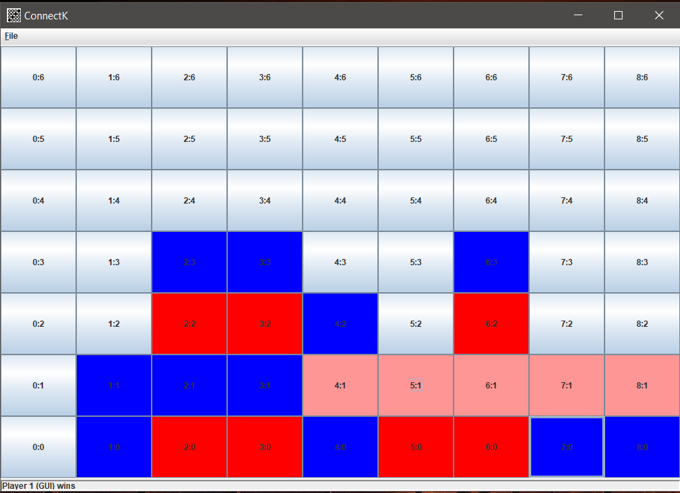

# ConnectKAI

Created an AI to play the board game Connect4 on any scale. Implemented with Minimax Search, Alpha-Beta Pruning, and Iterative Deepening Search. This was pair project with classmate [Ryan Jew](https://github.com/Kirbybooboo).

Implemented in Java. 

